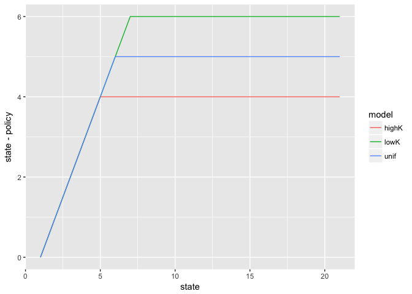
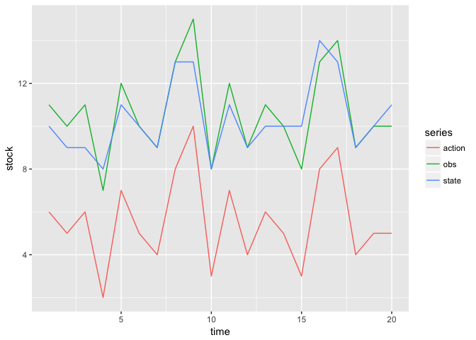

<!-- README.md is generated from README.Rmd. Please edit that file -->
[](https://travis-ci.org/boettiger-lab/mdplearning) [](https://ci.appveyor.com/project/boettiger-lab/mdplearning) [](https://codecov.io/github/boettiger-lab/mdplearning?branch=master) [](http://www.repostatus.org/#wip) [](https://cran.r-project.org/package=mdplearning)
[](https://zenodo.org/badge/latestdoi/68045474)

mdplearning
===========

Install
-------

``` r
devtools::install_github("boettiger-lab/mdplearning")
```

Basic Use
---------

Use transition matrices for two different modesl in an example fisheries system:

``` r
library("mdplearning")
library("ggplot2")
library("dplyr")
library("tidyr")
```

``` r
source(system.file("examples/K_models.R", package="mdplearning"))
transition <- lapply(models, `[[`, "transition")
```

Use the reward matrix from the first model (reward function is known)

``` r
reward <- models[[1]][["reward"]]
```

### Planning

Compute the optimal policy when planning over model uncertainty, without any adaptive learning. Default type is policy iteration. Default prior belief is a uniform belief over the models.

``` r
unif <- mdp_compute_policy(transition, reward, discount)
```

We can compare this policy to that of believing certainly in either model A or in model B:

``` r
lowK  <- mdp_compute_policy(transition, reward, discount, c(1,0))
highK <- mdp_compute_policy(transition, reward, discount, c(0,1))
```

We can plot the resulting policies. Note that uniform uncertainty policy is a compromise intermediate between low K and high K models.

``` r
dplyr::bind_rows(unif = unif, lowK = lowK, highK = highK, .id = "model") %>%
  ggplot(aes(state, state - policy, col = model)) + geom_line()
```



We can use `mdp_planning` to simulate (without learning) by specifying a fixed policy in advance. `mdp_planning` also permits us to include observation error in the simulation (though it is not accounted for by MDP optimization).

``` r
df <- mdp_planning(transition[[1]], reward, discount, x0 = 10, Tmax = 20, 
              policy = unif$policy, observation = models[[1]]$observation)


df %>% 
  select(-value) %>% 
  gather(series, stock, -time) %>% 
  ggplot(aes(time, stock, color = series)) + geom_line()
```



### Learning

Given a transistion matrix from which the true transitions will be drawn, we can use Bayesian learning to update our belief as to which is the true model. Note that we must now specify a list of transition matrices representing the models under consideration, and separately specify the true transition. The function also now returns a list, which includes two data frames; one for the time series as before, and another showing the evolution of the posterior belief over models.

``` r
out <- mdp_learning(transition, reward, discount, x0 = 10, 
               Tmax = 20, true_transition = transition[[1]])
```

The final belief shows a strong convergence to model 1, which was used as the true model.

``` r
out$posterior[20,]
#>    V1           V2
#> 20  1 1.587274e-14
```
