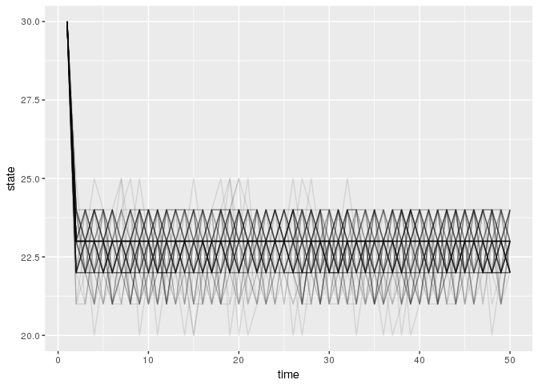

# parameter-uncertainty
Carl Boettiger  
8/25/2016  


```r
library("mdplearning")
library("appl")
library("tidyverse")
#knitr::opts_chunk$set(cache = TRUE)
```

Initialize a simple POMDP model for fisheries:


```r
set.seed(1234)
states <- 0:40
actions <- states
observed_states <- states
reward_fn <-  function(x, a) pmin(x, a)
sigma_g <- 0.1 # approx var of unif 0.1
sigma_m <- 0.25
discount <- 0.99
Tmax <- 20
```


We consider parameter uncertainty by examining the Ricker model over a range of `r` values, a range of `K` values, and a range of growth noise `sigma_g` values. We also consider
the Allen model over a range of Allee threshold `C` values:


```r
rs <-  seq(0, 2, length.out = 11)
r_models <- lapply(rs, function(r) 
  function(x, h){
    K <- 40
     s <- pmax(x - h, 0)
     s * exp(r * (1 - s / K) )
  })
    

Ks <-  seq(5, 45, length.out = 11)
K_models <- lapply(Ks, function(K) 
  function(x, h){
     r <- 0.5
     s <- pmax(x - h, 0)
     s * exp(r * (1 - s / K) )
  })


#Cs <- seq(0,25, length.out = 11)
Cs <- seq(0, 12, by = 3)
C_models <- lapply(Cs, function(C) 
  function(x, h){
     r <- 0.5
     K <- 30
     s <- pmax(x - h, 0)
     s * exp(r * (1 - s / K) * (s - C) / K )
  })
```


We compute the transition matrices for each, as before:


```r
get_matrices <- function(models){
  matrices <- lapply(models, function(model) 
    appl::fisheries_matrices(states = states, actions = actions, 
                             observed_states = states, reward_fn = reward_fn,
                             f = model, sigma_g = sigma_g, sigma_m = sigma_m))

  lapply(matrices, `[[`, "transition")
}

r_matrices <- get_matrices(r_models)
K_matrices <- get_matrices(K_models)
C_matrices <- get_matrices(C_models)


sigmas <- seq(0.01, 0.5, length.out = 11)
matrices <- lapply(sigmas, function(sigma_g) 
    appl::fisheries_matrices(states = states, actions = actions, 
                             observed_states = states, reward_fn = reward_fn,
                             f = r_models[[6]], sigma_g = sigma_g, sigma_m = sigma_m))

sigma_matrices <- lapply(matrices, `[[`, "transition")


utility <- matrices[[1]]$reward
```


## Planning for Uncertainty

First we consider the optimal solution where we simply average over the uncertainty.  We consider the policy resulting from a uniform uncertainty 
over $r \in [0, 2]$ compared to fixing r at a low ($r = 0.2$), average ($r = 1$), and high values ($r = 2$)
from that range. 

Likewise, we consider $K \in [5, 45]$ compared to fixing C at a low ($K = 9$), average ($K = 25$), and high values ($K = 45$)

For $C$ parameter in the Allen model, we consider $C \in [0, 12]$ compared to fixing C at a low ($C = 3$), average ($C = NA$), and high values ($C = NA$)


For $\sigma$ parameter in the Ricker model, we consider $\sigma \in [0.01, 0.5]$ compared to fixing sigma at a low ($\sigma = 0.059$), average ($\sigma = 0.255$), and high values ($\sigma = 0.5$)


```r
compare_policies <- function(transition){
  
  max <- length(transition)
  mid <- round((length(transition)+1) / 2)
  
  qt_unif <- rep(1, length=length(transition)) / length(transition)
  unif <- mdp_compute_policy(transition, utility, discount, qt_unif)

  qt_high <- numeric(length(transition))
  qt_high[max] <- 1
  high <- mdp_compute_policy(transition, utility, discount, qt_high)
  
  qt_mean <- numeric(length(transition))
  qt_mean[mid] <- 1
  mean <- mdp_compute_policy(transition, utility, discount, qt_mean)
  
  
  qt_low <- numeric(length(transition))
  qt_low[2] <- 1
  low <- mdp_compute_policy(transition, utility, discount, qt_low)

  data.frame(states, low = low$policy, mean = mean$policy, high = high$policy, unif = unif$policy) 
  
}
```


```r
policies <- map2_df(list(r_matrices, K_matrices, C_matrices, sigma_matrices), list("r", "K", "C", "sigma"),
               function(matrices,label) data.frame(model = label, compare_policies(matrices))
)
```

```
## Warning in bind_rows_(x, .id): Unequal factor levels: coercing to character
```


```r
policies %>% 
  gather(prior, policy, -states, -model) %>%
  ggplot(aes(states, states - actions[policy], col=prior, lty=prior)) + 
  geom_line() + ylab("escapement") + facet_wrap(~model)
```

<!-- -->


### Value of Perfect Information

From this, we can also define the value of perfect information for these scenarios.  We define the value of information as a function of the starting state, x0. For 
each possible starting state, we compute the value of each of the policies above under the assumption that reality is either fixed at the high parameter value
or the low parameter value of the range. For example, $r = 0.2$, and $r = 2$.  We examine the value resulting from the assumption of a uniform 
prior normalized by the value resulting from perfect knowledge of the parameter, assuming the paramater is the higher value (`unif_high`) or the lower (`unif_low`).  
We also compare the value resulting from using the wrong value of the parameter
without accounting for uncertainty at all, i.e. assuming $r = 0.2$ when it is $r = 2$ (referred to as `low_high`) and vice versa (`high_low`).  


We compute the value of a fixed policy using the identical dynamic programming around Bellman recursion as in finding the optimal solution; only the given policy
is used in computing the value of each step rather than necessarily selecting the action that would maximize that value.  This allows us to compute the value
of a policy derived under one set of assumptions (transition matrix) when applied under a different set.

Alternately we could have computed the value of information by averaging the value of replicate forward simulations, which is more noisy but has the added
benefit of illustrating the distribution of outcomes.  We will revisit that approach later.  


```r
value_of_information <- function(x){
  policies <- x[[1]]
  transition <- x[[2]]
  
  model <- x[[3]]
  
  max <- length(transition)
  
  # gives a single transition matrix as model list
  low_low =   mdp_value_of_policy(policies$low, list(transition[[2]]),   utility, discount)
  high_high = mdp_value_of_policy(policies$high, list(transition[[max]]), utility, discount)
  unif_low = mdp_value_of_policy(policies$unif, list(transition[[2]]), utility, discount) / low_low
  high_low = mdp_value_of_policy(policies$high, list(transition[[2]]), utility, discount)  / low_low
  unif_high = mdp_value_of_policy(policies$unif, list(transition[[max]]), utility, discount) / high_high
  low_high =  mdp_value_of_policy(policies$low, list(transition[[max]]),  utility, discount)  / high_high
  data.frame(state = policies$states, unif_low = unif_low, unif_high = unif_high, low_high = low_high, high_low = high_low, model = model)
}
```


```r
relative_value <- list(
           list(filter(policies, model=="r"), r_matrices, "r"), 
           list(filter(policies, model=="K"), K_matrices, "K"), 
           list(filter(policies, model=="C"), C_matrices, "C"), 
           list(filter(policies, model=="sigma"), sigma_matrices, "sigma")) %>%
  map_df(value_of_information)
```

```
## Note: max number of iterations reached
## Note: max number of iterations reached
## Note: max number of iterations reached
## Note: max number of iterations reached
## Note: max number of iterations reached
## Note: max number of iterations reached
## Note: max number of iterations reached
## Note: max number of iterations reached
## Note: max number of iterations reached
## Note: max number of iterations reached
## Note: max number of iterations reached
## Note: max number of iterations reached
## Note: max number of iterations reached
## Note: max number of iterations reached
## Note: max number of iterations reached
## Note: max number of iterations reached
## Note: max number of iterations reached
## Note: max number of iterations reached
## Note: max number of iterations reached
## Note: max number of iterations reached
## Note: max number of iterations reached
## Note: max number of iterations reached
## Note: max number of iterations reached
```

```
## Warning in bind_rows_(x, .id): Unequal factor levels: coercing to character
```
  

```r
relative_value  %>%
    gather(scenario, value, -state, -model) %>%
    ggplot(aes(state, value, col = scenario)) + 
  geom_point() + 
  facet_wrap(~model) + coord_cartesian(ylim = c(0,1))
```

<!-- -->


Several patterns are clear.  Since no policy is better than the optimal policy for the scenario, these relative values are always all be less than 1, as expected.  Second, accounting for uncertainty should always be better than ignoring it and using the wrong value: that is, `unif_high` is always better than `low_high`, and `unif_low` always better than `high_low`.  Note that scenarios with different underlying models cannot easily be directly compared since they are normalized to different optimums -- there is no general reason to expect that `unif_low` is larger or smaller than `unif_high`.

Beyond these expected patterns are the more interesting ones.  For instance, the value of sigma results in only small differences in policy, such that even this large uncertainty in sigma (`unif`) permits almost as much value as knowing sigma precisely. This holds regardless of whether the actual shocks are large (`unif_high`) or small (`unif_low`), both curves are consistently near 1.  In fact, even using the wrong value of `sigma` directly results in only a small loss of value.  In this context, _learning_ sigma matters little to the overall value.

For the parameter r, there is a noticable cost to using the wrong value and ignoring the parameter uncertainty.  (The relative cost is greater when underestimating r, green being below red).  Accounting for uncertainty largely resolves this, with the values of both `unif_low` and `unif_high` being near 1, which suggests there is little room to improve further by _learning_, even if learning was very efficient.  

With parameter K in the Ricker model, there is greater value to learning; particularly if K tends to be towards the low end of what is expected (`unif_low`), where accounting for uniform uncertainty results in values around only 50% of perfect information.  Even if the true K is large, uniform uncertainty gives only 75% of the value of perfect information, indicating plenty of room for improvement.

Under each of the above scenarios in the Ricker model, the value is realtively independent of the starting state.  The slight increase for higher starting states simply reflects the value of the first harvest that brings the population down towards in constant escapement target.  Under the Allen model, things are different due to the presense of the tipping point (Allee threshold).  Lower starting stock sizes all account for greater and greater probability of collapse (or below the threshold, probability of escape from collapse). Due to the stochastic growth this does not appear as a sharp transition.  Assuming the population starts at a size large enough to avoid accidental collapse at the start, we see a pattern similar but somewhat less pronounced than we did with K in the Ricker model.  If the true Allee threshold is only at very low stocks, then accounting for uncertainty can result in a nearly optimal value, and perfect knowledge is of little additional utility.  For thresholds at more precarious, higher stock levels, information is more valuable (particularly if the starting stock is not too small).  


## Planning only


```r
Tmax <- 50
true_i <- 3
x0 <- 30
unif <- mdp_compute_policy(C_matrices, utility, discount)
df <- mdp_planning(C_matrices[[true_i]], utility, discount, x0 = x0, Tmax = Tmax, policy = unif$policy)
```


```r
df %>% ggplot(aes(time, state)) + geom_line() + geom_line(aes(y = action), col = "red")
```

<!-- -->

### Replicates:


```r
sims <- 
map_df(1:100, 
       function(i) mdp_planning(C_matrices[[true_i]], utility, discount, x0 = x0, Tmax = Tmax, policy = unif$policy),
  .id = "rep")
```


```r
sims %>% 
  ggplot(aes(time, state, group = rep)) + geom_line(alpha = 0.5)
```

<!-- -->

How many have collapsed? 


```r
sims %>% filter(time == Tmax) %>% summarise(sum(state == 1))
```

```
##   sum(state == 1)
## 1               0
```


### What if the true model is pomdp?


```r
matrices <- appl::fisheries_matrices(states = states, actions = actions, 
                             observed_states = states, reward_fn = reward_fn,
                             f = C_models[[true_i]], sigma_g = sigma_g, sigma_m = 0.25)
observation <- matrices$observation  

sims <- 
map_df(1:100, 
       function(i) mdp_planning(C_matrices[[true_i]], reward = utility, discount = discount, x0 = x0, Tmax = Tmax, observation = observation, policy = unif$policy),
  .id = "rep")

sims %>% 
  ggplot(aes(time, state, group = rep)) + geom_line(alpha = 0.1)
```

<!-- -->

```r
#How many have collapsed? 
sims %>% filter(time == Tmax) %>% summarise(sum(state == 1))
```

```
##   sum(state == 1)
## 1               0
```


## Learning


```r
Tmax <- 50
true_i <- 3
out <- mdp_learning(C_matrices, utility, discount, x0 = x0, Tmax = Tmax, true_transition = C_matrices[[true_i]])
```

Simulation trajectories:


```r
out$df %>% select(-value) %>% gather(series, stock, -time) %>%
  ggplot(aes(time, stock, color = series)) + geom_line()
```

<!-- -->

Belief over models (over time)


```r
out$posterior %>% rownames_to_column("time") %>% 
  gather(par, value, -time) %>%
  mutate(time = as.numeric(time)) %>% 
  filter(time %in% seq(1,50, by=10)) %>%
  ggplot(aes(par, value, alpha=time)) + geom_bar(stat="identity", position="dodge")
```

<!-- -->


Replicate simulations:


```r
sims <- 
map_df(1:100, 
       function(i) mdp_learning(C_matrices, utility, discount, x0 = x0, Tmax = Tmax, true_transition = C_matrices[[true_i]])$df, 
  .id = "rep")
```


```r
sims %>% 
  ggplot(aes(time, state, group = rep)) + geom_line(alpha = 0.5)
```

<!-- -->

How many have collapsed? 


```r
sims %>% filter(time == Tmax-1) %>% summarise(sum(state == 1))
```

```
##   sum(state == 1)
## 1               0
```


### Learning in other parameters

We have a much easier time learning the right value of the other parameters.

#### Learning over K


```r
Tmax <- 50
true_i <- 3
out <- mdp_learning(K_matrices, utility, discount, x0 = x0, Tmax = Tmax, true_transition = K_matrices[[true_i]])
```

Simulation trajectories:


```r
out$df %>% select(-value) %>% gather(series, stock, -time) %>%
  ggplot(aes(time, stock, color = series)) + geom_line()
```

<!-- -->

Belief over models (over time)


```r
out$posterior %>% rownames_to_column("time") %>% 
  gather(par, value, -time) %>%
  mutate(time = as.numeric(time)) %>% 
  filter(time %in% seq(1,50, by=10)) %>%
  ggplot(aes(par, value, alpha=time)) + geom_bar(stat="identity", position="dodge")
```

<!-- -->


#### Learning over r

Learning the r parameter is also quite efficient:


```r
Tmax <- 50
true_i <- 3
out <- mdp_learning(r_matrices, utility, discount, x0 = x0, Tmax = Tmax, true_transition = r_matrices[[true_i]])
```

Simulation trajectories:


```r
out$df %>% select(-value) %>% gather(series, stock, -time) %>%
  ggplot(aes(time, stock, color = series)) + geom_line()
```

<!-- -->

Belief over models (over time)


```r
out$posterior %>% rownames_to_column("time") %>% 
  gather(par, value, -time) %>%
  mutate(time = as.numeric(time)) %>% 
  filter(time %in% seq(1,50, by=10)) %>%
  ggplot(aes(par, value, alpha=time)) + geom_bar(stat="identity", position="dodge")
```

<!-- -->


#### Learning over sigma


```r
Tmax <- 50
true_i <- 3
out <- mdp_learning(sigma_matrices, utility, discount, x0 = x0, Tmax = Tmax, true_transition = sigma_matrices[[true_i]])
```

Simulation trajectories:


```r
out$df %>% select(-value) %>% gather(series, stock, -time) %>%
  ggplot(aes(time, stock, color = series)) + geom_line()
```

<!-- -->

Belief over models (over time)


```r
out$posterior %>% rownames_to_column("time") %>% 
  gather(par, value, -time) %>%
  mutate(time = as.numeric(time)) %>% 
  filter(time %in% seq(1,50, by=10)) %>%
  ggplot(aes(par, value, alpha=time)) + geom_bar(stat="identity", position="dodge")
```

<!-- -->

