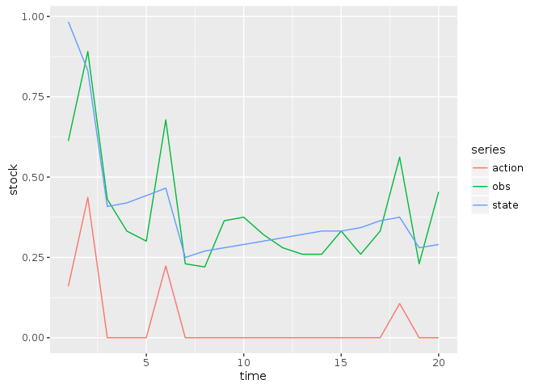
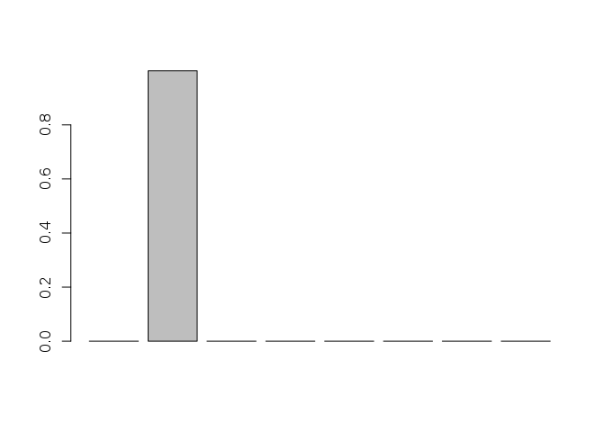
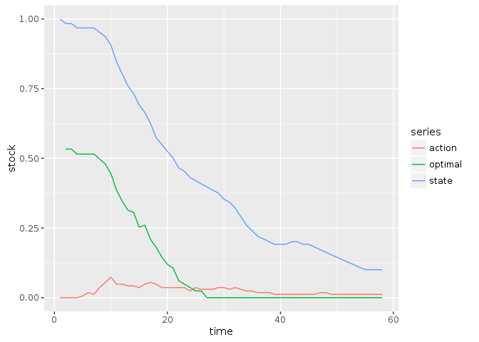
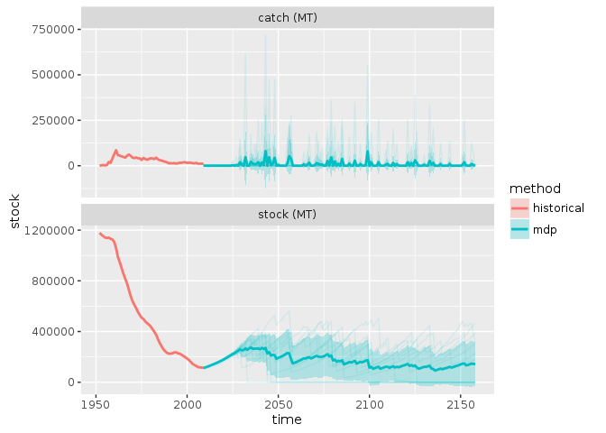

Carl Boettiger  


```r
library("mdplearning")
library("appl")
library("ggplot2")
library("tidyr")
library("purrr")
library("dplyr")
#knitr::opts_chunk$set(cache = TRUE)
```


```r
## choose the state/action/obs space
states <- seq(0,1.2, length=100) # Vector of all possible states
actions <- seq(0,.8, length=100)   # Vector of actions: harvest
obs <- states
K <- 0.9903371
r <- 0.05699246
sigma_g <- 0.01720091
discount <- 0.99

vars <- expand.grid(r = seq(0.05, 0.3, by =0.05), sigma_m = c(0.1, 0.3, 0.6))
fixed <- data.frame(model = "ricker", sigma_g = sigma_g, discount = discount, K = K, C = NA)
models <- data.frame(vars, fixed)

## Usual assumption at the moment for reward fn
reward_fn <- function(x,h) pmin(x,h)

## Compute alphas for the above examples
tuna_models <- lapply(1:dim(models)[1], function(i){
  f <- switch(models[i, "model"],
              allen = appl:::allen(models[i, "r"], models[i, "K"], models[i, "C"]),
              ricker = appl:::ricker(models[i, "r"], models[i, "K"])
  )

  appl::fisheries_matrices(states, actions, obs, reward_fn, f = f,
                     sigma_g = models[i, "sigma_g"], sigma_m  = models[i, "sigma_m"])


})
```


```r
models <- tuna_models[7:12]  ## 1:6 = sigma 0.1, 7:12 = sigma 0.3, 13:18 = sigma 0.6
reward <- models[[1]]$reward
transition <- lapply(models, `[[`, "transition")
observation <- models[[1]]$observation
```


## MDP Policies


```r
unif <- mdp_compute_policy(transition, reward, discount)
```


```r
x0 <- which.min(abs(states - K))
Tmax <- 20
```

## MDP Planning


```r
df <- mdp_planning(transition[[1]], reward, discount, x0 = x0, Tmax = Tmax, 
              policy = unif$policy, observation = observation)
```


```r
df %>% 
  select(-value) %>%
  mutate(state = states[state], obs = states[obs], action = actions[action]) %>% 
  gather(series, stock, -time) %>% 
  ggplot(aes(time, stock, color = series)) + geom_line()
```

<!-- -->

## MDP Learning


```r
out <- mdp_learning(transition, reward, discount, x0 = x0, Tmax = Tmax, 
              observation = observation, 
              true_transition = transition[[1]])
```


```r
out$df %>% 
  select(-value) %>% 
  mutate(state = states[state], obs = states[obs], action = actions[action]) %>% 
  gather(series, stock, -time) %>% 
  ggplot(aes(time, stock, color = series)) + geom_line()
```

<!-- -->


```r
barplot(out$posterior[Tmax,])
```

<!-- -->

## MDP Historical


```r
data("scaled_data")
## Map continuous data to enumerated state / action
y <- sapply(scaled_data$y, function(y) which.min(abs(states - y)))
a <- sapply(scaled_data$a, function(a) which.min(abs(actions - a)))

out <- mdp_historical(transition, reward, discount, state = y, action = a)
```


```r
out$df %>% 
  #mutate(state = states[state], recommended = actions[recommended], action = actions[action]) %>% 
  gather(series, stock, -time) %>% 
  ggplot(aes(time, stock, color = series)) + geom_line()
```

<!-- -->


```r
Tmax <- length(y)

barplot(out$posterior[Tmax,])
```

<!-- -->
